# 🌈 sentiment-analysis-node-api

[](https://github.com/Kan1shka9/sentiment-analysis-node-api/blob/master/LICENSE)     [](https://www.npmjs.com/)

[](https://nodejs.org/en/)

A simple REST API built using node which is used to perform sentiment analysis.

```sh
npm start
```

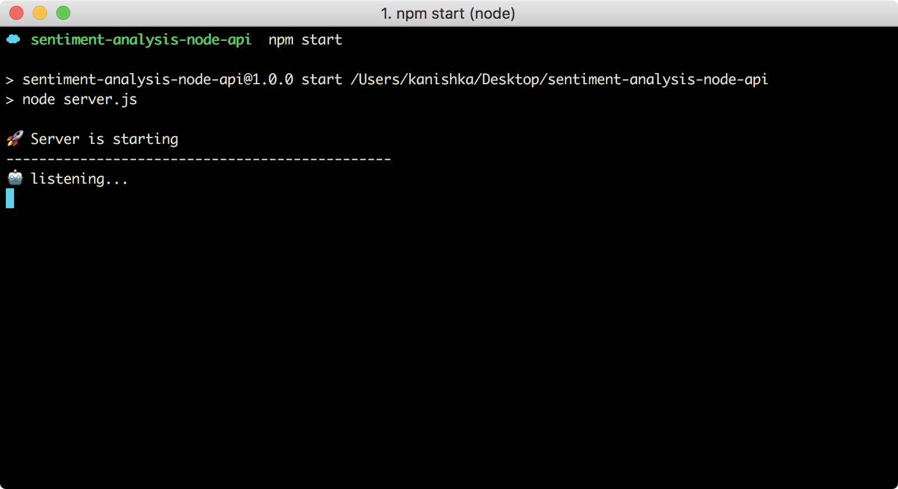

```
http://localhost:3000/all
```

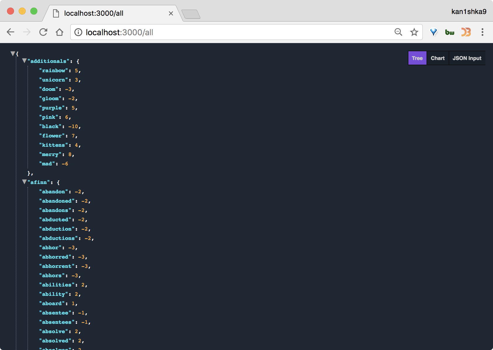

```
http://localhost:3000/add/angry/-9
```

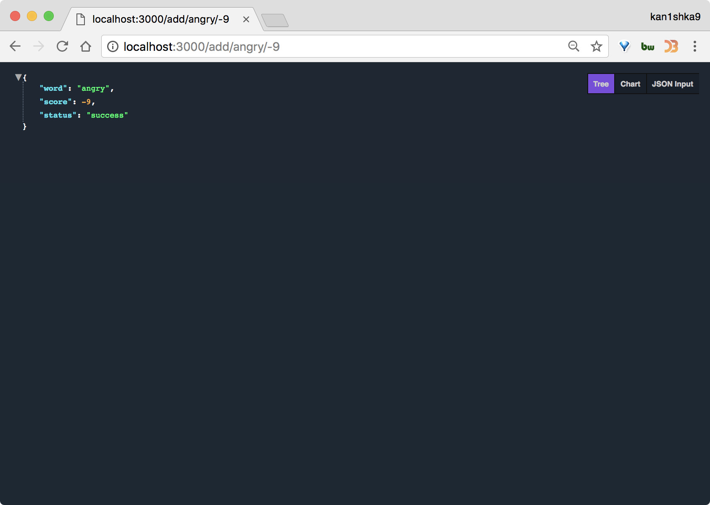

```
http://localhost:3000/search/mad
```

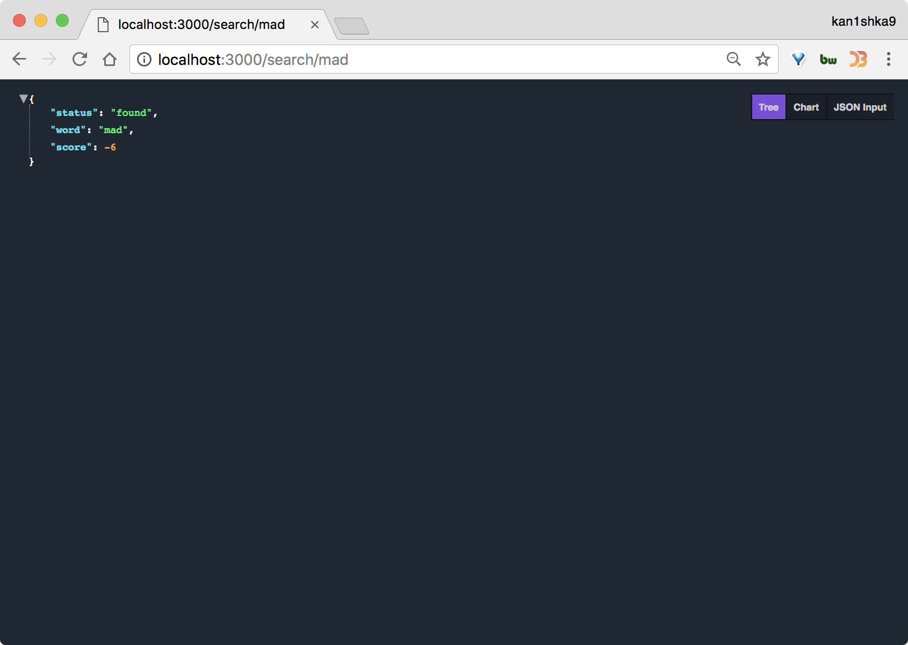

```
http://localhost:3000/search/notexist
```

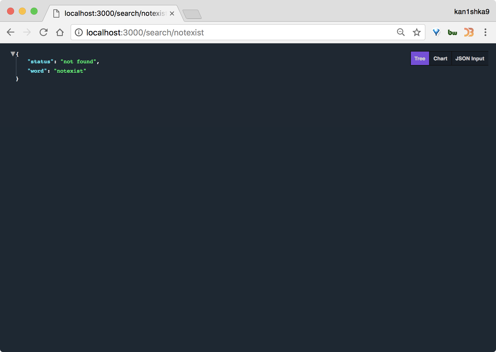

```
http://localhost:3000/
```

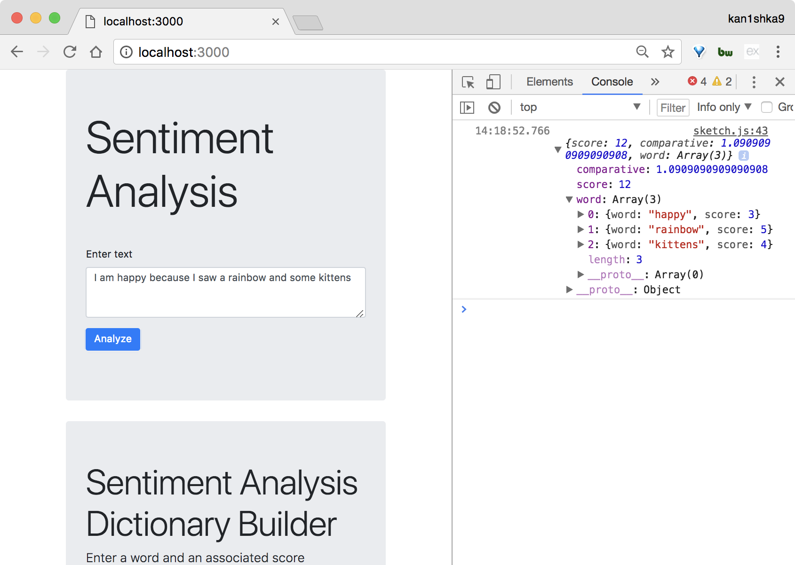

```sh
http localhost:3000/all
```

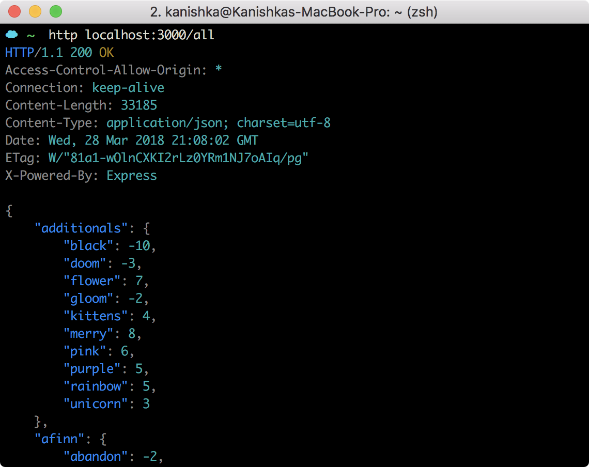

```sh
http localhost:3000/add/merry/8
```

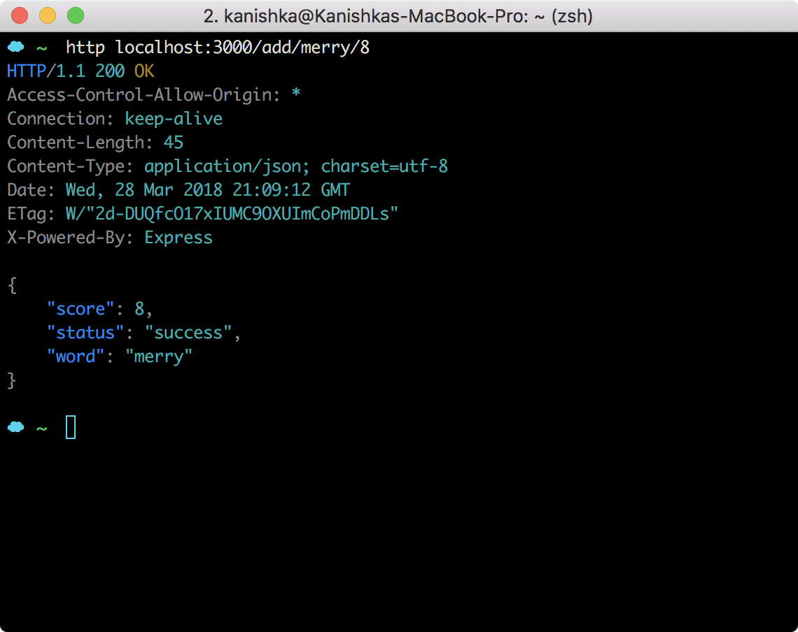

```sh
http localhost:3000/search/kittens
```

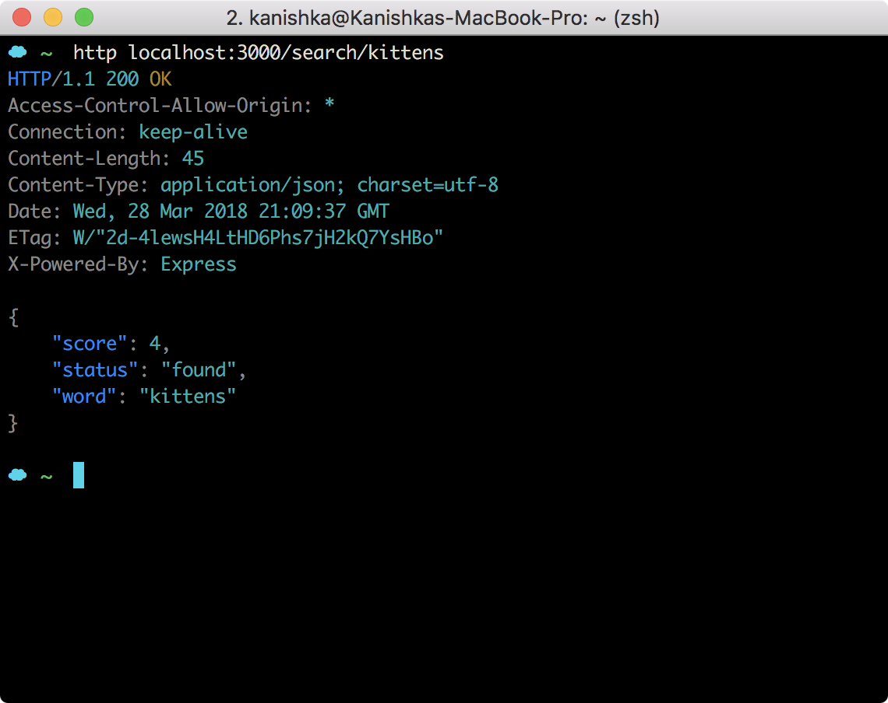

```sh
http localhost:3000/search/notexist
```

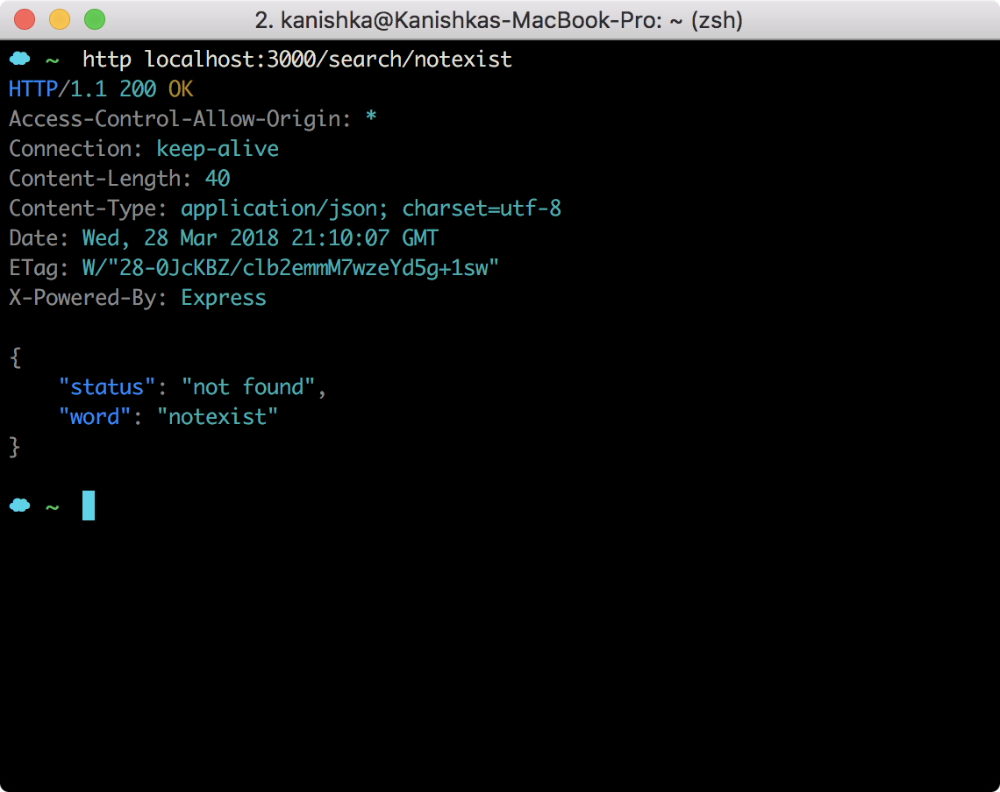

```sh
http POST localhost:3000/analyze text="I am happy because I saw a rainbow and some kittens"
```

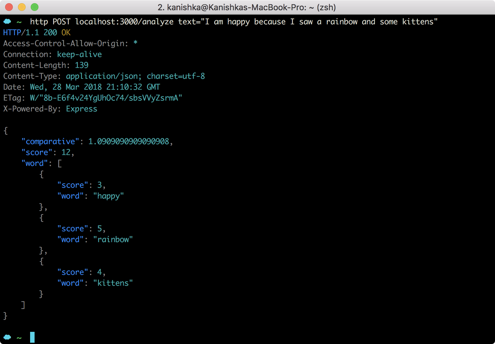
